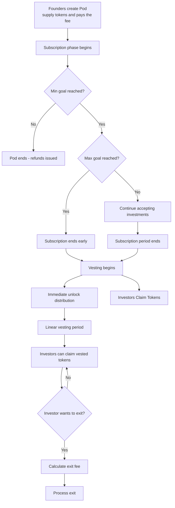

# Beelievers Kickstarter

_Bring creative projects to life with incentives for BTCFi_

This repository provides Sui Move packages (smart contracts).

## Synopsis

Beelievers Kickstarter is a decentralized crowdfunding and incubation platform with a token distribution mechanism, built on Sui blockchain. It's designed to launch and accelerate the next generation of innovative projects from _DeFi and beyond_.

Following the [Beelievers](https://www.gonative.cc/beelievers) mission:

> to build the ultimate Bitcoin app and yield ecosystem. No trade-offs on trust or sovereignty - the Web3 native way!

additional incentives are provided for BTCFi and dWallet projects.

## Why

### Problem 1: Launchpads Not Having Risks Mitigations

ICOs are not only a new form of financing but also an example for the potential democratisation of finance, allowing retail to participate in the entrepreneurial fiance that was previously limited to “sophisticated” investors.

Token launchpads have strayed from their original promise—empowering founders and protecting investors. Today, investors face high risks: rug pulls, unclear tokenomics, and locked capital. Founders struggle to access fair, sustainable funding.

### Problem 2: The BTCFi Funding Gap

Observation: Today, we don't have a vibrant Web3 Bitcoin ecosystem. BTC is used statically (holders) or for trading in various centralized exchanges or funds.
Thesis: BTCFi to thrive needs a strong ecosystem of builders, users and investors.

Observation: Communities are formed around "user" markets.
Thesis: Bitcoin Community will be formed on powerful L1 chains that will bring use to BTC.

BTCFi ecosystem face a critical bottleneck:

- Lack of a good funding infrastructure: Existing launchpads (on Ethereum, Solana) are not optimized for Bitcoin's unique architecture, creating friction and fragmentation.
- Trust Issues in Crowdfunding: web3 platforms don't target BTCFi. Wha's more worrying, many of them target meme coins.
- Speculative & Risky Participation: Early-stage participation is often rife with rug pulls, unfair launches, and a lack of transparency.

## Key Features

- All-or-Nothing Funding: Project must reach their minimum investment goal to receive any funds. This protects backers and motivates creators.
- Curated Vetting & Incentives: Projects can apply for BTCFi incentives. Upon review by the Beelievers committee, additional incentives can be applied for investors, maintaining quality standards.
- Token Distribution: platform provides a stable token distribution mechanism through an investment mechanism.
- Strong Community: Beelievers Kickstarter aims to be the most recognized brand in crowdfunding with a built-in community of active backers.

## Specification

### Roles

- Investors
- Projects founders (team): create a funding campaign.
- Beelievers Committee: Curates projects and manages incentives.

### Flow



### Objects

- Pod: a structure, created by founders representing a funding campaign.
- Token Allocation: Distribution plan for project tokens

### System Parameters

| Parameter                   | Default  | Description                                                                                                    |
| --------------------------- | -------- | -------------------------------------------------------------------------------------------------------------- |
| `max_immediate_unlock`      | 10%      | Maximum % of funds team receives immediately after successful raise. It's also used to calculate the exit fee. |
| `min_vesting_duration`      | 3 months | Minimum vesting duration for a Pod                                                                             |
| `min_subscription_duration` | 7 days   | Minimum subscription period duration                                                                           |
| `exit_small_fee`            | 0.8%     | Reduced exit fee during grace period                                                                           |
| `small_fee_duration`        | 3 days   | Grace period with reduced exit fees                                                                            |
| `cancel_subscription_keep`  | 0.1%     | Amount kept when investor cancels subscription                                                                 |
| `setup_fee`                 | 5 SUI    | Setup fee charged to pod creators                                                                              |
| `treasury`                  | -        | Address where setup fees are sent                                                                              |

### Phase 1: Pod Creation

Founders create a `Pod` and:

1. specify:
   - Subscription phase: start and end date (duration must be ≥ `min_subscription_duration`).
   - Token vesting duration (e.g., 12 months).
   - `immediate_unlock`: Percentage of funds the team wants to unlock immediately (must be ≤ `max_immediate_unlock`).
   - Accepted currency (e.g., USDC).
   - Token price (e.g., 0.1 USDC/token).
   - `min_investment_goal` and `max_investment_goal` (e.g., min=100k USDC, max=200k USDC).
   - `price_multiplier`- allows scaling the price: `token_allocation = investment_amount × price_multiplier / token_price`.
1. supply tokens to the `Pod`. The amount must equal `max_investment_goal / token_price`.
1. supply `setup_fee` SUI.
1. attach a pitch deck and business plan.
1. link a forum/discourse thread for community discussion.

### Phase 2: Investors Subscription

Once a pod is created, anyone can subscribe for investment during the subscription phase:

1. Investors put the accepted currency in the `Pod` to subscribe for tokens.
1. If the minimum investment goal is not reached before the subscription end date:
   - the Pod is canceled,
   - investors receive 100% of their investment back,
   - Project tokens are returned from the smart contract.
1. If the maximum investment goal is reached before the subscription end date:
   - The subscription phase ends early.

During the subscription phase investors can cancel their subscription by calling `cancel_subscription`. `investment × cancel_subscription_keep` will be kept as an investment. This will be fully refundable if the Pod didn't reach the `min_investment_goal`. Otherwise, this will be kept as a reduced investment.
NOTE: investor can cancel the subscription only once. If an investor cancels his subscription, and then invest more, then he can't cancel it again.

### Phase 3: Vesting and Token Distribution

Starts when the minimum investment goal is reached and the subscription period ended. Let `F` be the total amount of funds raised.

- Investors can claim `immediate_unlock` of their token allocation.
- Founders can claim `immediate_unlock × F`.
- Founders can withdraw the unallocated tokens.

Following this, a linear real-time vesting period begins:

- Founders receive funds according to the vesting schedule.
- Investors can claim their vested tokens.

Progress Update: Founders should provide regular progress updates through the linked forum/discourse thread (this is not tracked on-chain). Failure to provide updates may trigger investor exiting form their investment.

### Exit Mechanism

At any time, an investor can exit their investment if they believe the team is not meeting expectations or need liquidity. Investor is charged a fee when exiting, to protect the founders from a massive exit:

- If the exit occurs during `small_fee_duration` after vesting starts: `exit_small_fee` is charged.
- After `small_fee_duration`: the fee is charged based on the pod `immediate_unlock` value.

**Exit Calculation Details:**
Let: `I` = Amount invested by the investor, `A` = token allocation for the investor, `Vd` = vesting duration, `Ts` = vesting start time, `T` = exit time.

The vested portion at time `T` is: `vested_portion = (T-Ts)/Vd`.

```
fee = if(T <= Ts + small_fee_duration) exit_small_fee  else  exit_fee
claim_back = I × (1 - immediate_unlock) × (1 - vested_portion) × (1 - fee)
tokens_received = A × (1 - immediate_unlock) × (1 - vested_portion)
```

Remaining unvested tokens are returned to the founders.

## Consequences

1. By setting a minimum investment goal, founders define the minimum budget needed to launch the project and build a community. Minimum goals reduce investor risk.
2. Realistic Goal Setting: Founders must justify budgets and build investor confidence.
3. If investors lack confidence, they can exit during the subscription period, protecting initial investors and ensuring teams have planned properly.
4. Market Validation: Failed subscriptions signal lack of market fit
5. Growth Potential: Successful pods can create follow-on funding rounds
6. Balance & checks mechanism based on `immediate_unlock`: Founders can set higher immediate unlock, that will impose higher fee on the investors when exiting. This will cause higher scrutiny and due diligence when subscribing to the project. Smaller `immediate_unlock` will make it less risky for investors (smaller fee for exit). `max_immediate_unlock` to protect the platform from greedy investors setting too high immediate unlock.

Risk Mitigation

- Investor Protection: All-or-nothing model prevents underfunded projects
- Team Incentive Alignment: Vesting ensures long-term commitment
- Liquidity Options: Graduated exit fees balance flexibility and commitment
- Transparent Process: Clear milestones and community discussion

## Future versions

New versions are planned with additional features.
